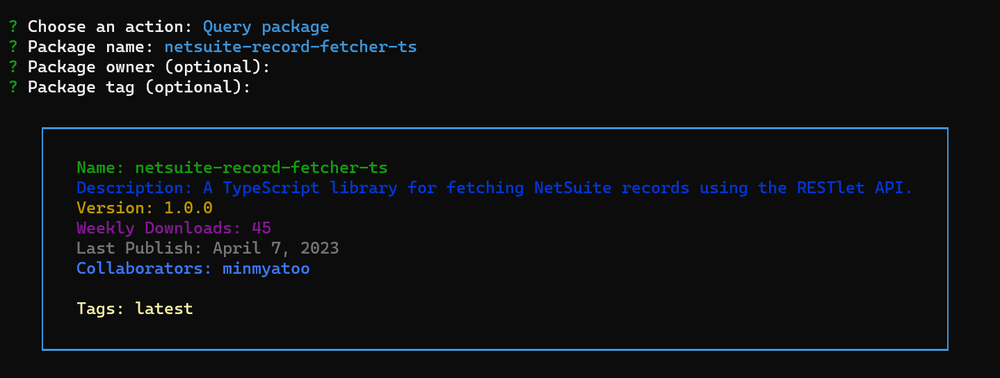

📦🔍 **npm-package-info**

Discover the simplicity of this command-line tool, designed to effortlessly query and search for npm packages.



## Features 🌟

- Retrieve npm package details, including:
  - Name
  - Description
  - Version
  - Weekly Downloads
  - Last Publish Date
  - Collaborators
  - Owner (if provided)
  - Tags
- Conduct npm package searches using keywords

## Installation 📦

1. Clone the repository:

```sh
git clone https://github.com/minmyatoo/npm-package-info.git
```

2. Navigate to the repository folder:

```sh
cd npm-package-info
```

3. Install the necessary dependencies:

```sh
npm install
```

4. Run the script:

```sh
npm start
```

## Usage 📝

When executing the script, you'll be prompted to choose an action: "Search by keywords" or "Query package."

- If you select "Search by keywords," enter the keywords to search for packages. The script will display a list of package names based on your input.

- If you opt for "Query package," you'll be prompted to provide the package name, owner (optional), and tag (optional). The script will then present comprehensive package information, including name, description, version, weekly downloads, last publish date, collaborators, owner (if provided), and tags.
